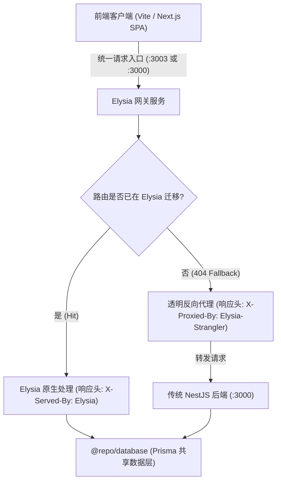

# @repo/server-elysia

基于 [Elysia.js](https://elysiajs.com/) 构建的现代化、高性能后端服务，专为平滑、渐进式替代重构现有的 NestJS 单体服务（`@repo/server`）而设计。

## 架构与重构策略：绞杀者模式 (Strangler Fig Pattern)

为了保证生产环境与现有前端业务的平稳过渡，本项目采用**绞杀者网关模式**：



1. **零改造成本**：前端可直接将 API 请求指向 Elysia 网关。
2. **渐进式迁移**：
   - 当某个模块（例如班级查询、积分规则）在 Elysia 中实现后，Elysia 优先接管该路由。
   - 尚未迁移的路由（如暂未重构的复杂功能、批量导入、历史统计）由 `src/proxy.ts` 自动、透明反向代理给 NestJS。
   - 开发者可通过响应头中的 `X-Served-By: Elysia` 或 `X-Proxied-By: Elysia-Strangler` 快速辨识路由处理方。

---

## 运行时支持

同时支持 **Bun** 原生极致性能与 **Node.js 24+** 跨平台兼容运行：

- **Bun 模式**（推荐，本地开发体验极佳）：`bun --watch src/index.ts`
- **Node.js 模式**（标准兼容与 CI 自动化）：基于 `@elysiajs/node` 与 `tsx watch`

---

## 常用开发命令

在仓库根目录下运行：

```bash
# 使用 Node.js (tsx) 启动 Elysia 服务 (默认端口 3003)
pnpm dev:elysia

# 使用 Bun 启动 Elysia 服务 (毫秒级热更)
pnpm dev:elysia:bun

# 单独对 Elysia 进行类型检查
pnpm --filter @repo/server-elysia typecheck

# 单独对 Elysia 进行代码格式规范检查
pnpm --filter @repo/server-elysia lint

# 构建打包产物到 dist/
pnpm --filter @repo/server-elysia build
```

---

## 核心目录结构

```
apps/server-elysia/
├── src/
│   ├── config.ts               # 环境变量与配置管理
│   ├── proxy.ts                # Strangler 透明反向代理兜底处理器
│   ├── index.ts                # 主应用入口，挂载 Swagger、CORS、路由与兜底代理
│   ├── plugins/
│   │   ├── prisma.ts           # 共享 @repo/database 的 Prisma 插件
│   │   ├── auth.ts             # JWT 解析与凭据守卫宏 (requireUser, requireAuth)
│   │   └── error-handler.ts    # 全局错误捕获，对齐 Nest 响应契约 { code, message, requestId }
│   └── modules/
│       ├── health/             # 系统健康探针与运行时状态 (GET /api/v1/health)
│       └── classrooms/         # 班级模块重构试点 (GET /api/v1/classes)
├── .env.example
├── package.json
└── tsconfig.json
```

---

## 接口文档

服务启动后可直接访问 Swagger UI：
`http://localhost:3003/api/docs`
OpenAPI JSON 规范位于：
`http://localhost:3003/api/docs/json`
