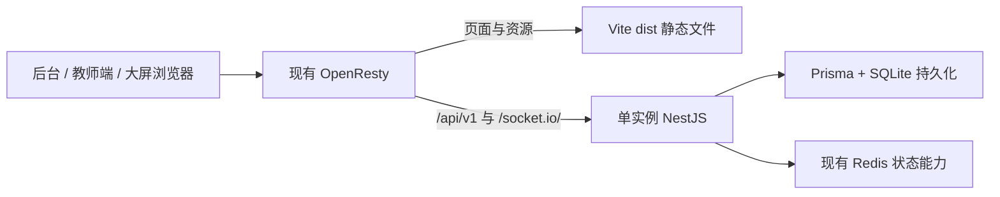

# 部署与资源占用轻量化评估

评估日期：2026-09-03。代码基准：`31b3cef`。用户优先目标：降低部署复杂度和服务器资源占用，同时保留业务行为。Vite 迁移仍未实施；当前已先实现可选的 Next.js 静态导出兼容支路，默认 standalone 运行方式保持不变。

## 建议

优先采用 **Vite + React SPA + 现有 NestJS + Prisma + SQLite + Socket.IO**，使用已有 OpenResty 托管前端静态文件。先精简生产镜像，再替换前端运行方式，最后根据生产测量结果决定是否迁移后端。

这条路径可以移除 Next.js 常驻进程和前端生产容器，保留已经实现的权限、事务与实时协议。Vite 是构建工具，生产部署不运行 Vite dev / preview；构建产物由静态服务器提供。[Vite 静态部署](https://vite.dev/guide/static-deploy)

Elysia + Vite 可以作为后续目标，但目前没有证据证明 NestJS 是主要资源瓶颈，也不能由框架吞吐量基准推导本应用内存节省。

## 当前证据

| 观察                                                | 代码证据                                                                                                         | 对决策的影响                                                           |
| --------------------------------------------------- | ---------------------------------------------------------------------------------------------------------------- | ---------------------------------------------------------------------- |
| 两个 runner 都复制完整已安装的工作区                | `Dockerfile:18`、`Dockerfile.web:18` 均为 `COPY --from=builder ... /app ./`；builder 均全工作区安装依赖          | 生产镜像携带不必要源码、开发工具与另一应用依赖；即使不换框架也能精简   |
| Next.js 作为单独服务常驻                            | `deploy/docker-compose.yml` 的 web 服务运行 `next start`；OpenResty 的 `/` 转发到 3001                           | 静态前端可以直接去掉这一服务                                           |
| 主要业务数据来自浏览器调用独立 API                  | `ClassroomSystemProvider` 固定注入 `apiClassroomService` 与 `SocketIoRealtimeClient`                             | React 页面、service、hooks 与大部分 UI 可以保留                        |
| Next 专属依赖范围有限                               | 扫描 `apps/web/src`：11 个文件直接引用 `next` / `next/*`，主要为导航、图片及元数据；另需改页面壳、布局与构建配置 | Vite 迁移主要集中在入口、路由和少量框架 API，11 个文件并非全部改动量   |
| 未发现业务依赖 Server Actions / Next Route Handlers | 源码扫描未发现 `use server`、`next/headers`、`next/server`；app 下无 `route.ts`                                  | 未发现必须保留 Next 服务端的业务数据链路；仍需浏览器回归确认           |
| 有动态邀请页与 Next 图片组件                        | `/invite/[token]` 的服务端页面读取 params；多处 `next/image`；首页调用 redirect                                  | 静态模式需固定邀请入口、客户端跳转和无优化图片；兼容支路已实现         |
| 后端已有完整领域行为                                | 14 个 Controller 文件、55 个 HTTP 方法装饰器、31 个 DTO 文件、21 个 Service 文件、4 个 Guard 文件                | 整体换后端涉及协议、权限、校验和生命周期，不只是改路由语法             |
| 当前部署使用 SQLite                                 | `deploy/docker-compose.yml` 挂载 SQLite 文件并运行 SQLite 迁移；根 compose 仍提供 PostgreSQL / Redis 开发服务    | 不应把删除 PostgreSQL 计入当前部署必然获得的收益；实际生产状态尚未检查 |
| Redis 有实际业务用途                                | `AuthService` 限流；`DisplaysService` 读写、原子消费绑定码和短期会话                                             | 不能直接删除依赖或以普通 Map 替代                                      |

源码规模为前端 97 个 TS/TSX 文件约 15,521 行，后端 147 个 TS 文件约 12,095 行（含测试、空行）。Prisma canonical schema 有 19 个 model。统计仅说明迁移范围，不代表内存、性能或镜像体积。

`admin-pages.tsx` 约 2,070 行、`teacher-surface.tsx` 约 1,518 行，确实存在维护复杂度；拆文件和 UI 库调整主要解决维护及浏览器负担，不能替代服务器资源优化。暂时保留 Refine、Ant Design、TanStack Query 和已有分层。

## 方案对比

| 方案                                  | 直接收益                                         | 改动 / 风险                                                           | 建议                                                      |
| ------------------------------------- | ------------------------------------------------ | --------------------------------------------------------------------- | --------------------------------------------------------- |
| 原栈 + 后端依赖裁剪 + Next standalone | 减少镜像、上传与磁盘占用；仍有两个应用进程       | 低；需正确保留 Prisma 引擎、迁移工具和 Next 静态资源                  | 可立即独立实施；若随后直接换 Vite，可跳过 standalone 过渡 |
| NestJS + Next 静态导出                | 去掉 Next 常驻进程                               | 低至中；动态邀请 URL、图片和首页跳转需适配                            | 希望尽量少动前端时的备选                                  |
| NestJS + Vite React SPA               | 去掉 Next 常驻进程；前端产物静态化，部署边界清晰 | 中；路由、错误边界、环境变量、图片与深链接需迁移                      | 首选目标                                                  |
| NestJS FastifyAdapter + Vite          | 保留 Nest 分层，替换 HTTP 引擎                   | 中；上传、异常处理、请求对象等有 Express 耦合；内存收益未测           | 仅在 HTTP CPU 成为瓶颈时评估                              |
| Elysia + Vite                         | 可进一步减少框架层和依赖                         | 高；重建认证、权限、DTO 校验、异常及 Socket.IO 接入；绝对内存收益未知 | 第二阶段之后再决定                                        |
| 原生 Fastify + Vite                   | 保持 Node.js，移除 Nest 装饰器 / DI 层           | 高；仍须完整迁移业务边界                                              | 不想切换运行时但坚持移除 Nest 时比较                      |

Next standalone 会生成较小的运行目录，但仍运行 Node.js 服务；需复制 public / static 并核对 monorepo 文件追踪范围。[Next output 文档](https://nextjs.org/docs/app/api-reference/config/next-config-js/output)

Next 静态导出不支持未预生成的动态路径和默认图片优化。邀请 token 在运行时产生，不能靠枚举 token 静态生成；备选方案需要固定邀请入口读取参数，并兼容旧邀请链接。Vite 的客户端动态路由可保留 `/invite/:token`，更适合此处。[Next 静态导出限制](https://nextjs.org/docs/app/guides/static-exports)

Nest 官方支持 FastifyAdapter，但明确要求适配 Express 专属能力。本项目学生导入使用 `FileInterceptor` / Multer，统一异常过滤器使用 `response.status(...).json(...)`；这些不能照搬。[Nest Fastify 文档源码](https://github.com/nestjs/docs.nestjs.com/blob/master/content/techniques/performance.md)、[Nest 文件上传](https://docs.nestjs.com/techniques/file-upload)

## Elysia 迁移边界

Elysia 官方提供 Node.js adapter，不强制同时改用 Bun。可以把“框架替换”和“运行时替换”分开；若最终选择 Bun，应独立验证当前 Prisma 6、SQLite 引擎、ExcelJS、Socket.IO 和生产镜像的兼容性。[Elysia Node.js 集成](https://elysiajs.com/integrations/node)

现有 Socket.IO 客户端不能直接连接 `Elysia.ws()`。Socket.IO 有自己的报文、握手和 namespace 协议，普通 WebSocket 不是兼容替代品。第一轮后端迁移应保留 Socket.IO 及其 `/socket.io/` transport path、`/realtime` namespace、班级房间、令牌到期和撤销断连行为；共用服务器的挂载方式必须通过原型验证。[Socket.IO 协议说明](https://socket.io/docs/v4/#what-socketio-is-not)、[Elysia WebSocket](https://elysiajs.com/patterns/websocket)

需要迁移的内容包括：

- Guard / Passport / Reflector 元数据转换为明确的认证、身份类型、班级访问和角色中间件；保留 Service 层访问检查。
- DTO 转换为运行时 schema，保持隐式类型转换、未知字段拒绝、嵌套校验、空值、日期及错误码行为；不能只迁移 TypeScript 类型。
- 成功 envelope、分页 meta、业务错误状态与 requestId 保持兼容，避免前端 service 同时重写。
- Nest 注入和生命周期改为显式组装；保留 Prisma 事务、唯一约束及提交后广播，先不更换 ORM / schema。
- 保留 JWT claims、算法、签名密钥、刷新令牌哈希和轮换、设备凭证及浏览器存储键，验证升级后既有会话可继续使用。
- 为大屏保留独立响应数据约束，防止迁移响应 schema 时泄露具体分数或倒数排名。

Eden 类型推导可后续评估，当前已有 ClassroomService 边界，迁移初期更换客户端协议会扩大范围。

## 推荐部署形态

相较仓库部署配置，前端不再需要常驻 Node.js 进程。保留一个后端实例以延续当前 SQLite 与连接管理方式；暂不引入微服务、SSR、额外 BFF 或双写。

服务器只运行发布产物。若当前在小规格生产机上执行依赖安装和构建，应转移到本地或 CI；这降低发布期间峰值资源，不等于降低 API 的常驻内存。

Redis 是否可以取消另作决策：当前内存回退的 `incr()` 通过不带 EX 的 `set()` 写值，导致旧 TTL 丢失，且过期键主要按访问清理。回退状态也不会跨实例或重启保留。正式单机模式必须实现等价过期、限流、原子消费与有界清理，并决定绑定会话是否需要数据库持久化。仅停止 Redis 不能证明业务不受影响。

## 执行顺序与验收

1. **建立资源和业务基线。** 记录生产镜像体积、应用容器内存及 CPU、空闲和课堂操作负载、冷启动、导入峰值、数据库查询耗时、在线 Socket 数。隔离发布构建峰值与常驻资源。先查明两个现有失败测试，并在目标数据库下建立通过的基线。
2. **精简镜像。** 后端仅携带编译产物、运行依赖、正确生成的 Prisma 客户端与引擎；迁移能力使用发布任务或保留所需文件，避免只装 production dependencies 后把 devDependency 中的 Prisma CLI 删掉。验证 SQLite 路径、目录写权限和备份恢复。此阶段可独立回滚。
3. **迁移前端。** 在开发分支或临时并行目录构建 Vite + React + React Router（客户端模式），复用 feature、service、session、query 与 Socket.IO。替换 Next 导航、图片、metadata、LayoutProps、动态 params、loading / error / not-found；将两处 NEXT_PUBLIC_API_ORIGIN 改为统一客户端配置。仅公开非敏感配置。
4. **静态部署验收。** OpenResty 保持 `/api/` 和 `/socket.io/` 专用代理；前端导航才回退到 index.html，丢失的静态资源应返回 404。保留原域名、路径和浏览器存储键，测试深链接刷新、旧邀请、前进后退、未保存草稿、登录续期、设备续期和断线后状态恢复。静态发布保留旧 hash 资源以照顾长期打开的大屏。
5. **切换前端并比较资源。** 保留旧 Next 发布物作为回退点；验收后停止旧 web 进程，避免并行常驻抵消节省。重新测量同样负载，达成目标即可结束迁移。
6. **仍有瓶颈才迁移后端。** 先用只读业务做 Elysia / Fastify 原型，比较同运行时、同数据库、同真实业务负载；逐模块提取可复用服务。认证、设备、积分最后迁。首选隔离环境验证后整体切换 API 所有权；如必须逐路由切换，要明确单写者和唯一实时发布通路，不引入跨框架双写。

业务验收至少覆盖：学生导入及去重；教师邀请、撤销和恢复；座位保存、版本冲突、恢复；课程表保存及大屏同步；规则 / 自定义 / 事件积分、重复撤销与月度汇总；班委和结算；随机点名；设备绑定并发和数量上限、撤销即时断连；跨班访问拒绝；大屏隐私字段；HTTP 与 Socket.IO 断线恢复。

## 本次验证与限制

- `pnpm --filter @repo/web typecheck`：通过。
- `pnpm --filter @repo/server test --runInBand`：18 个套件，16 通过、2 失败；90 个测试，88 通过、2 失败。
- 导入失败：`student-import.service.spec.ts:194` 期待 createMany 包含 `skipDuplicates: true`，实际参数没有该项。
- 设备失败：`displays.service.spec.ts:213` 期待显式 Serializable 事务选项，当前调用没有该参数。实现存在数据库分支，需要按目标数据库确认预期，不能只删断言。
- 本机 Docker daemon 不可连接，未获得实际镜像大小、容器内存或生产负载；未连接线上主机。所有收益均为结构判断，未声明节省百分比或 MB 数。
- 已运行 Next 静态导出构建和浏览器业务验收；静态产物可生成 `out`，登录、后台概览、学生管理、积分规则、积分记录和课程表入口已通过真实 API 验证。生产切换、数据库迁移和并发负载验证仍需按发布窗口执行，现有构建及浏览器验收不能代替这些验证。
